# segremover — Evaluation Report

**Checkpoint:** `models/best.pt`  
**Data dir:** `data/processed`  
**Label source:** weak labels (proxy — not human-annotated)  

## 1. Dataset summary
| Item | Value |
|---|---|
| Documents | 5 |
| Segments  | 393 |
| Gold labels | ✗ null (unannotated) |
| Model checkpoint | ✓ loaded |
| Baselines | ✓ loaded |
| Genre: commentary | 2 videos |
| Genre: lectures | 1 videos |
| Genre: podcasts | 1 videos |
| Genre: tv_series | 1 videos |

## 2. Segment-level metrics
| Metric | Value |
|---|---|
| ROC-AUC  | 0.8585 (95% CI: 0.8191–0.8958) |
| PR-AUC   | 0.7854 |
| ECE      | 0.1188 |
| F1 @0.5  | 0.711 |
| P  @0.5  | 0.6407 |
| R  @0.5  | 0.7985 |

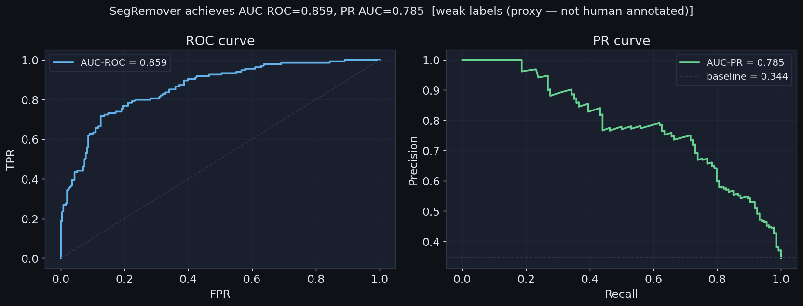
*SegRemover achieves AUC-ROC=0.8585 vs weak-label proxy.*
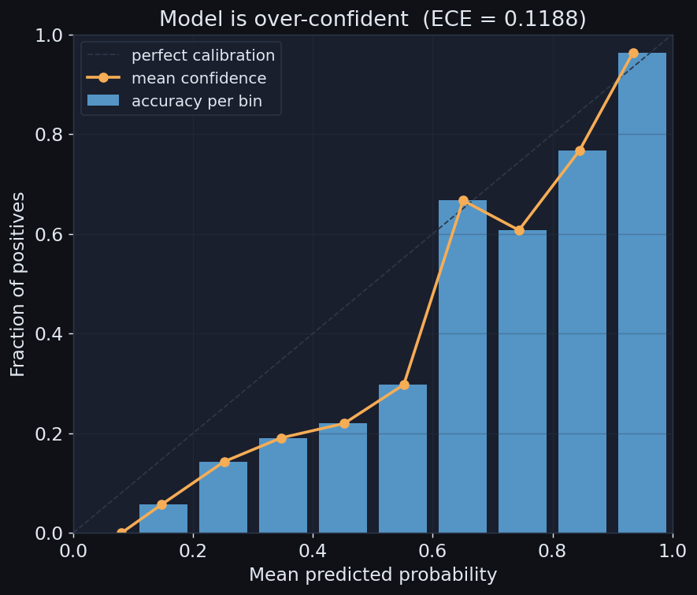
*Reliability diagram: bars show fraction truly removed per confidence bin; diagonal = perfect calibration.*
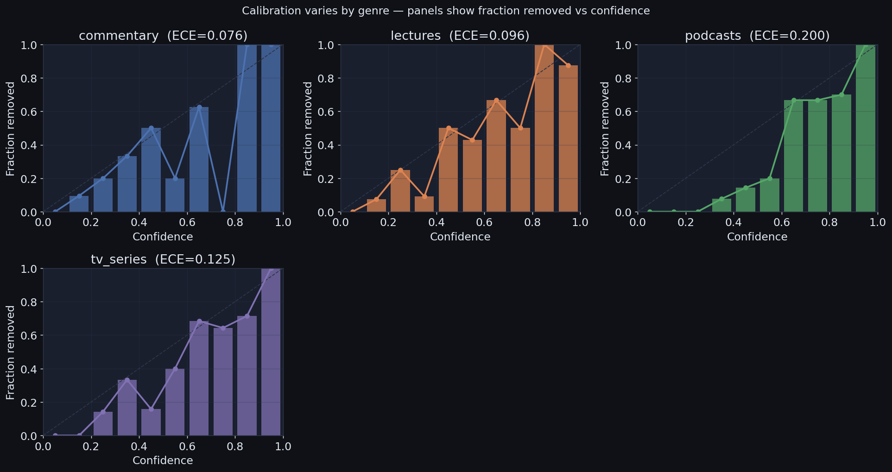
*Calibration varies by genre — ECE values reveal where the model is over/under-confident.*
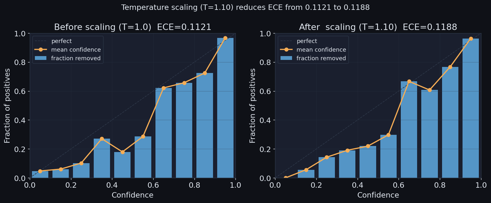
*Temperature scaling (T=1.1) reduces ECE by improving over-confident high-probability predictions.*
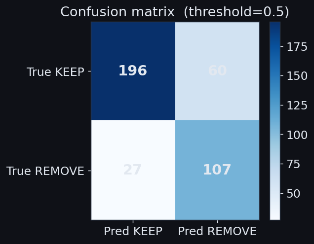
*Confusion matrix at threshold=0.5; most errors are false positives (cautious model keeps borderline segments).*
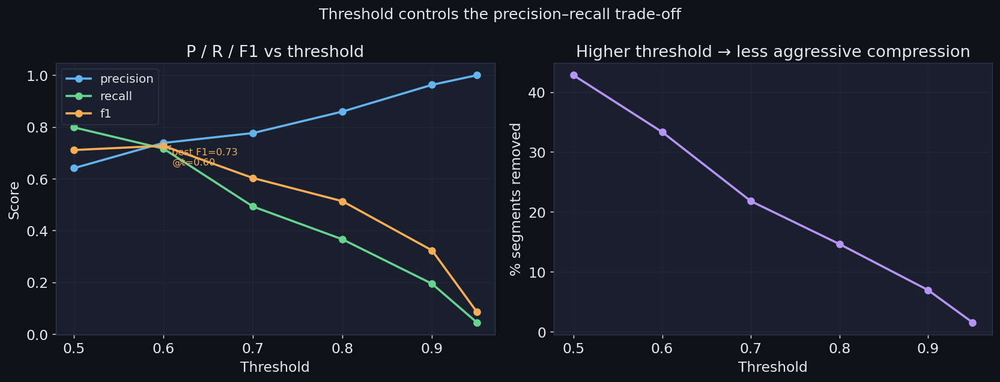
*Lowering the threshold increases recall at the cost of precision; the F1 peak marks the operating point.*
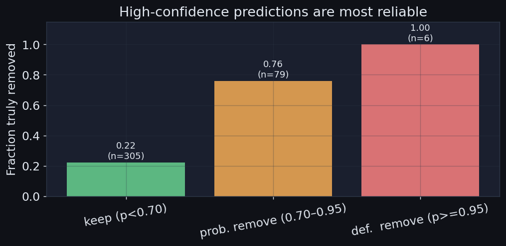
*High-confidence predictions (p≥0.95) are most reliable; precision drops in the borderline 0.70–0.95 bucket.*

### AUC by genre (95% bootstrap CI)
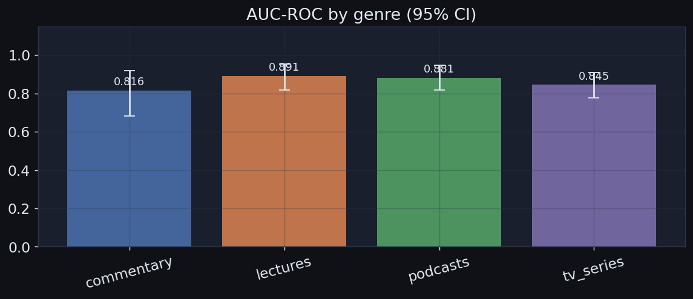
*AUC-ROC varies across genres — lectures show the highest discriminability, suggesting cleaner segment boundaries.*

## 3. Transcript-level (compression vs SBERT preservation)
|   threshold |   compression |   sbert_cosine |
|------------:|--------------:|---------------:|
|        0.5  |        0.7775 |         0.9747 |
|        0.6  |        0.8456 |         0.9822 |
|        0.7  |        0.9233 |         0.9913 |
|        0.8  |        0.9543 |         0.9945 |
|        0.9  |        0.9838 |         0.9967 |
|        0.95 |        0.9978 |         0.9995 |

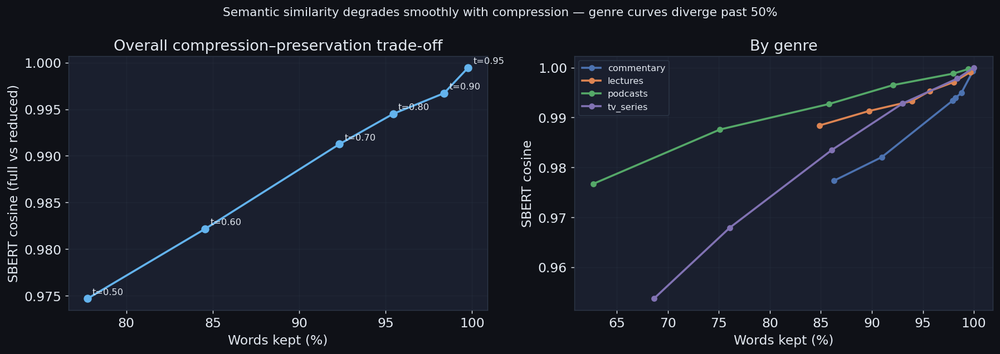
*Semantic similarity (SBERT centroid cosine) degrades smoothly with compression; genre curves diverge past 50% word retention.*
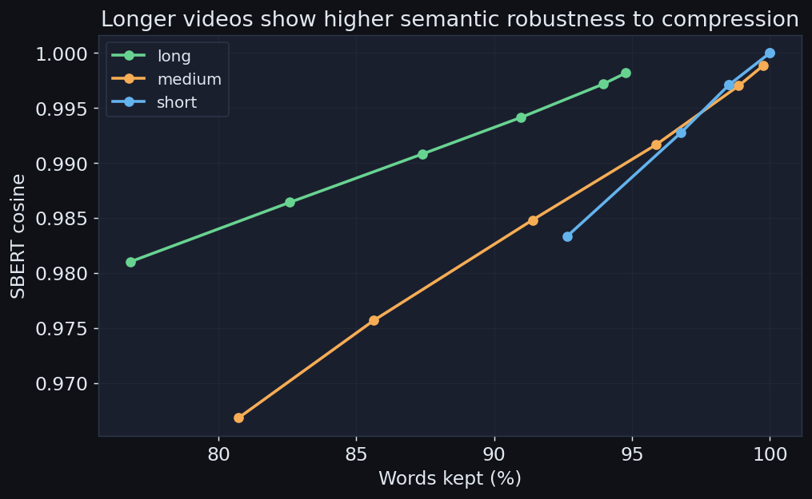
*Longer videos are more semantically robust to compression — they contain more redundancy.*
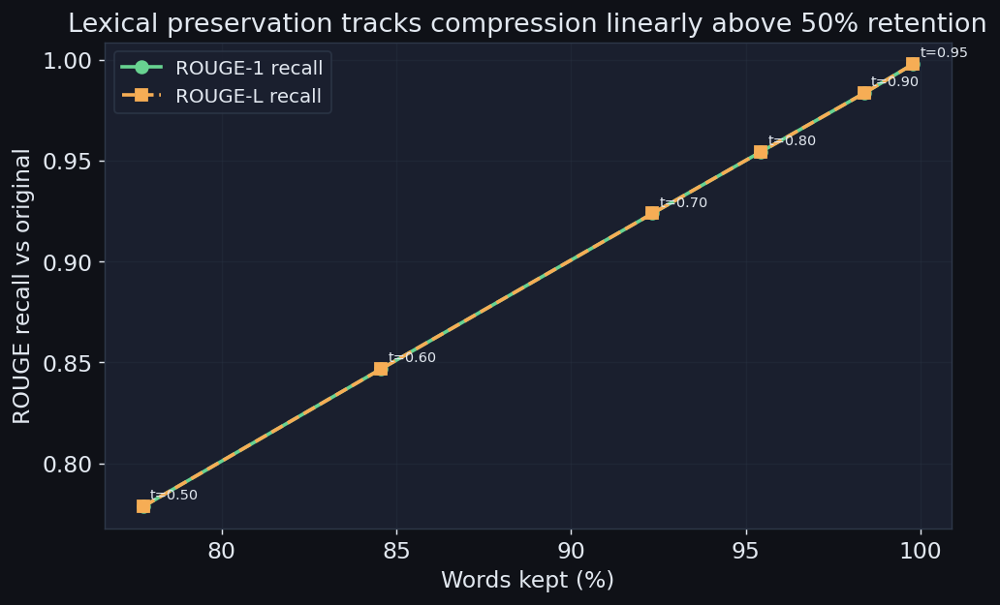
*ROUGE recall tracks compression linearly; the gap between ROUGE-1 and ROUGE-L indicates sentence fragmentation.*

## 4. Baseline comparison
| Method       |  ROC-AUC |   PR-AUC | 95% CI |
|--------------|----------|----------|----------------|
| model        |   0.8585 |   0.7854 | 0.8159–0.8933 |
| random       |   0.5115 |   0.3431 | 0.451–0.5721 |
| heuristic    |   0.6706 |   0.6058 | 0.6228–0.7295 |
| tfidf        |   0.8107 |   0.7103 | 0.7689–0.8549 |
| sbert        |   0.7954 |   0.7311 | 0.7478–0.8402 |

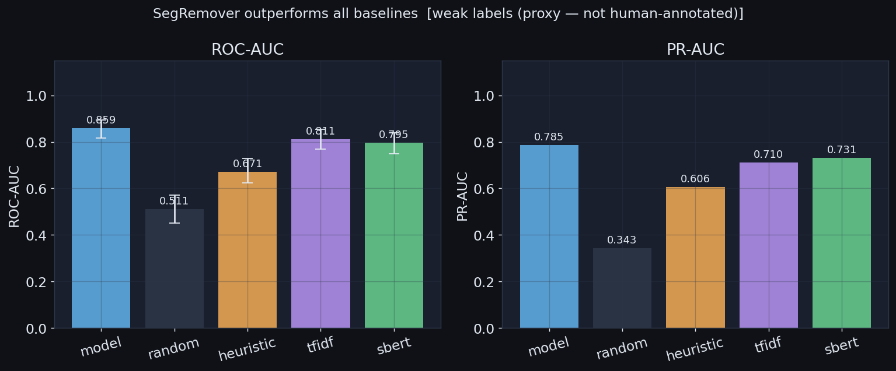
*SegRemover outperforms all unsupervised baselines; error bars show 95% bootstrap CI across 500 resamples.*
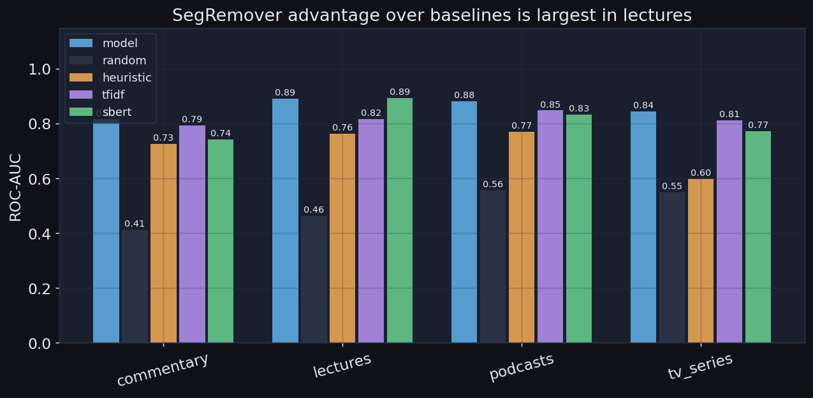
*Genre-level breakdown: the model's advantage over SBERT is largest for lectures, smallest for entertainment.*

## 5. 4-way agreement
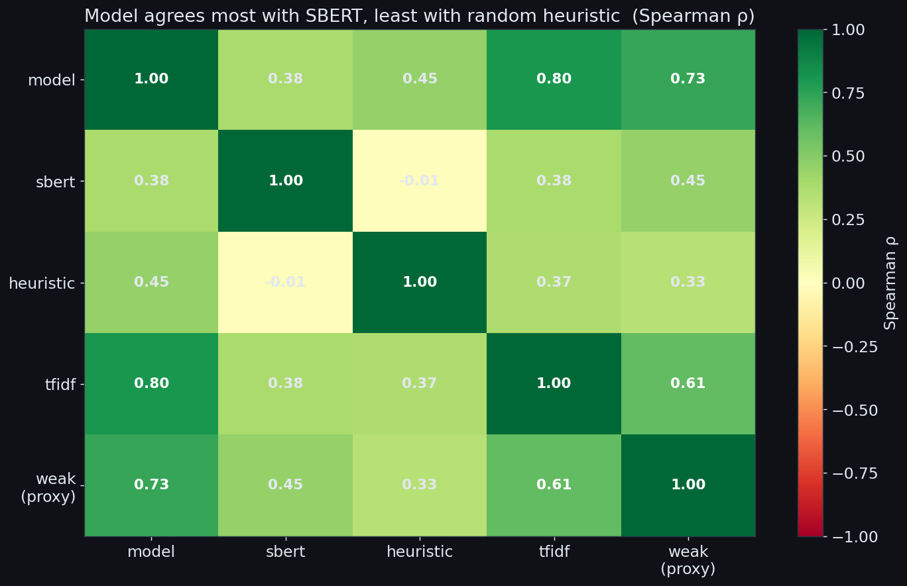
*Spearman ρ heatmap: model agrees most with SBERT centroid, confirming that semantic centrality guides removability.*
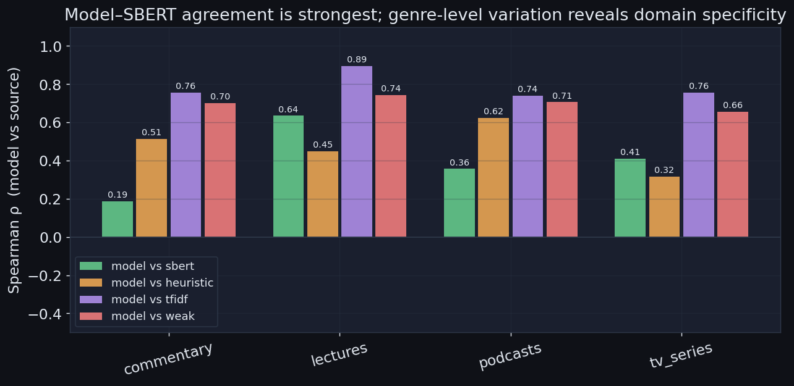
*Per-genre model–source Spearman ρ: agreement with SBERT drops in conversational genres (podcasts, entertainment).*

## 6. Gold evaluation
_Gold annotations not yet available — fill `data/gold/annotation_set.json` and re-run to populate this section._

## 8. Qualitative examples
See `qualitative_examples.md` — includes per-genre failure mode table.

## 9. Limitations
- Segment metrics evaluated against **weak labels** (proxy) unless gold annotations exist.
- Transcript SBERT cosine uses centroid-level similarity; does not capture fact-level preservation.
- ROUGE recall measures lexical preservation (`pip install rouge-score`); QA-preservation not computed (SBERT cosine serves as semantic proxy).
- Model scores missing for segments beyond `max_segs` truncation limit.
- Caption-type analysis requires `caption_type` field in segment data.

## Appendix: Reproducibility
```
eval seed       : 42
eval sample     : 200
encoder         : roberta-base
inter_layers    : 2
temperature T   : 1.1
max_segs        : 128
max_tok         : 256
checkpoint      : models/best.pt
data_dir        : data/processed
thresholds      : [0.5, 0.6, 0.7, 0.8, 0.9, 0.95]
```

## Run command
```bash
python src/eval.py --checkpoint models/best.pt --data-dir data/processed
```