# segremover — Evaluation Report

**Checkpoint:** `models/best.pt`  
**Data dir:** `data/processed`  
**Label source:** weak labels (proxy — not human-annotated)  

## 1. Dataset summary
| Item | Value |
|---|---|
| Documents | 993 |
| Segments  | 122,618 |
| Gold labels | ✓ human-annotated |
| Model checkpoint | ✓ loaded |
| Baselines | ✓ loaded |
| Genre: Commentary | 182 videos |
| Genre: Entertainment | 162 videos |
| Genre: Lectures | 238 videos |
| Genre: Podcasts | 178 videos |
| Genre: TED talks | 138 videos |
| Genre: TV series | 95 videos |

### Table 1: Corpus statistics by genre
| Genre | Videos | Segments | Mean seg length (words) | % positive (p_remove > 0.5) |
|---|---:|---:|---:|---:|
| Commentary | 182 | 12,325 | 90.2 | 35.5% |
| Entertainment | 162 | 25,218 | 41.5 | 48.4% |
| Lectures | 238 | 18,093 | 87.5 | 33.6% |
| Podcasts | 178 | 43,088 | 87.3 | 43.2% |
| TED talks | 138 | 2,805 | 116.3 | 34.0% |
| TV series | 95 | 21,089 | 34.3 | 46.3% |

## Evidence coverage checklist
| Evidence item | Status | Note |
|---|---:|---|
| Six-genre coverage | OK | all expected genres present |
| Direct removability by length | OK | generated |
| Caption-type robustness | WARN | caption_type missing or only one type |
| Gold/human evaluation | OK | gold labels loaded |
| Transcript-only risk scan | OK | generated |

## 2. Segment-level metrics
| Metric | Value |
|---|---|
| ROC-AUC  | 0.8811 (95% CI: 0.8792–0.8831) |
| PR-AUC   | 0.8384 |
| ECE      | 0.0593 |
| F1 @0.5  | 0.7683 |
| P  @0.5  | 0.7306 |
| R  @0.5  | 0.8102 |

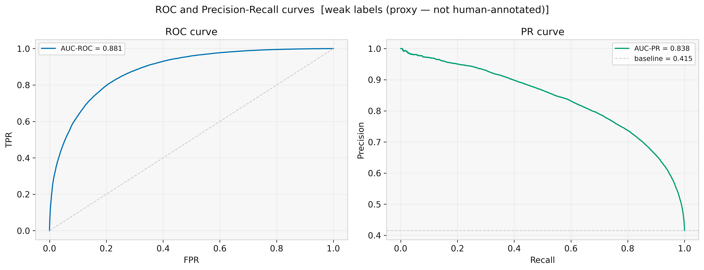
*SegRemover achieves AUC-ROC=0.8811 vs weak-label proxy.*
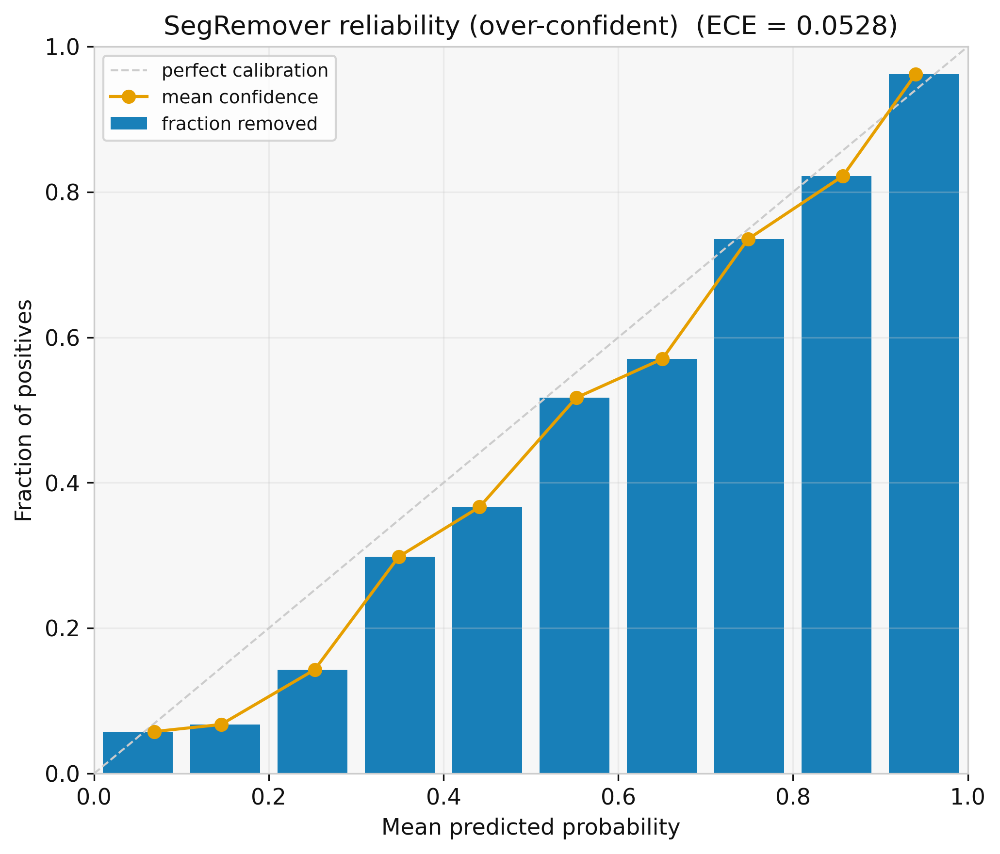
*Reliability diagram: bars show fraction truly removed per confidence bin; diagonal = perfect calibration.*
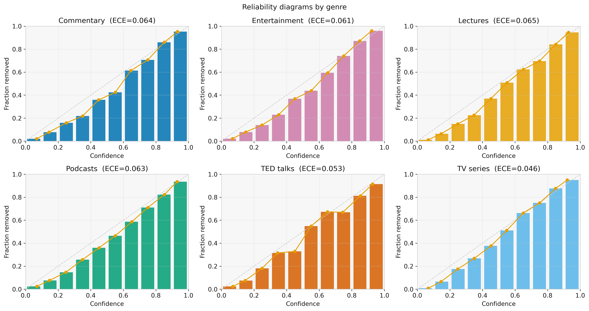
*Calibration varies by genre — ECE values reveal where the model is over/under-confident.*
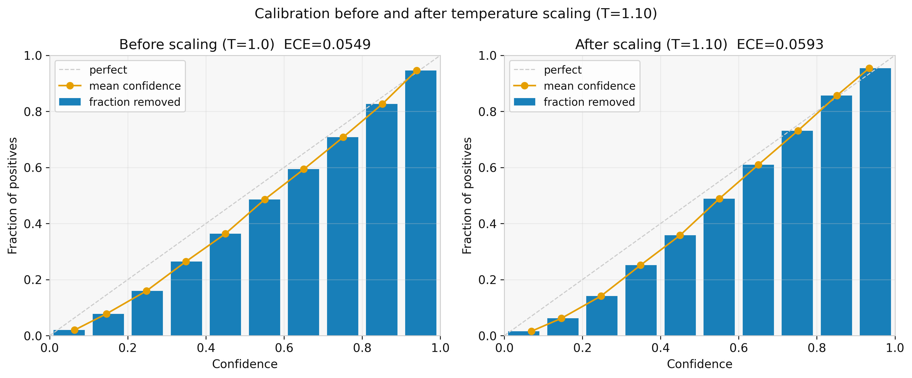
*Temperature scaling (T=1.1) changes ECE; this panel prevents claiming improvement when ECE increases.*
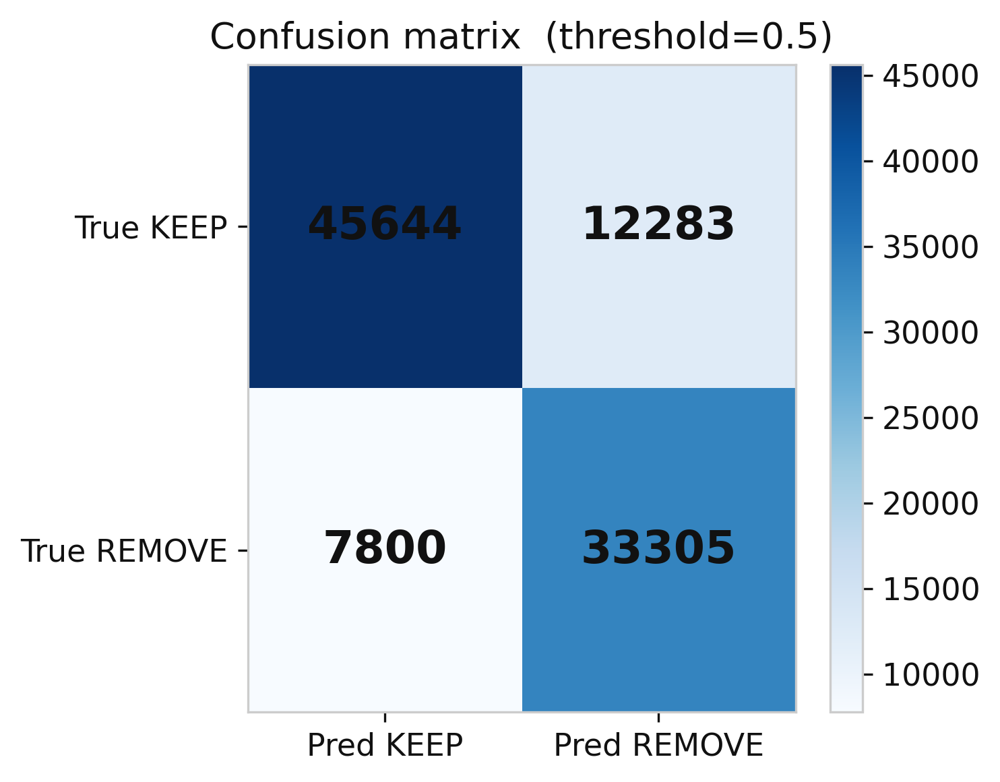
*Confusion matrix at threshold=0.5; most errors are false positives (cautious model keeps borderline segments).*
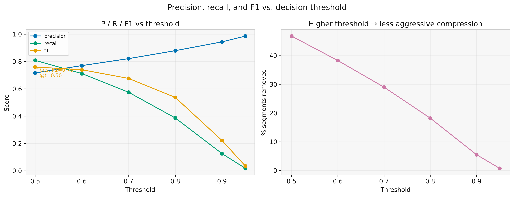
*Lowering the threshold increases recall at the cost of precision; the F1 peak marks the operating point.*
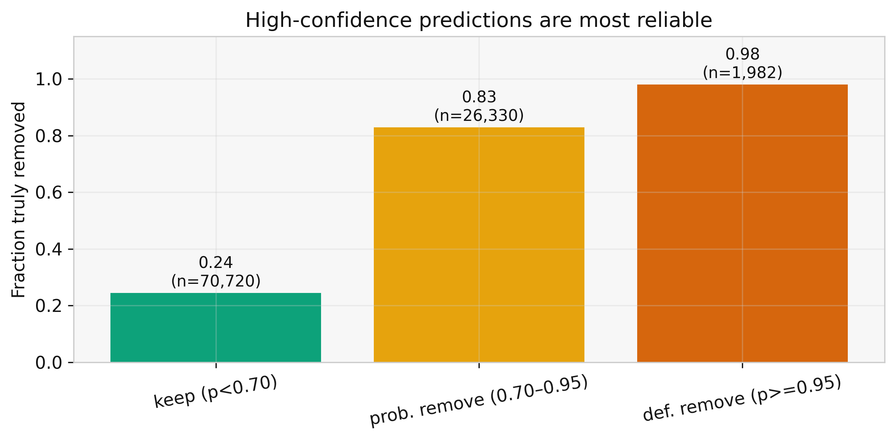
*High-confidence predictions (p>=0.95) are most reliable; precision drops in the borderline 0.70-0.95 bucket.*
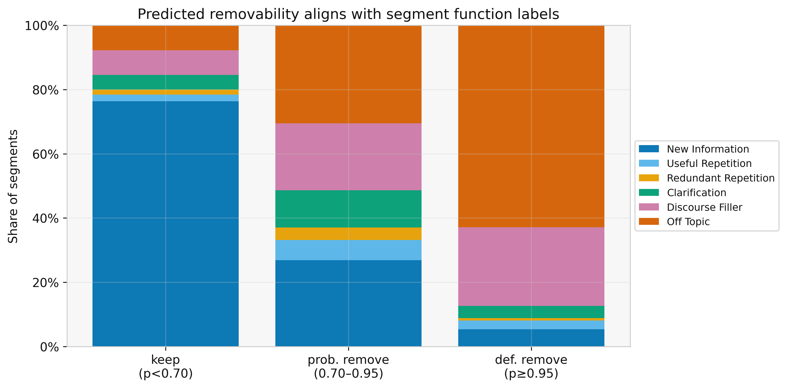
*Function-label mix by confidence bucket: this explains what the model tends to remove.*

### Head B — Function classifier
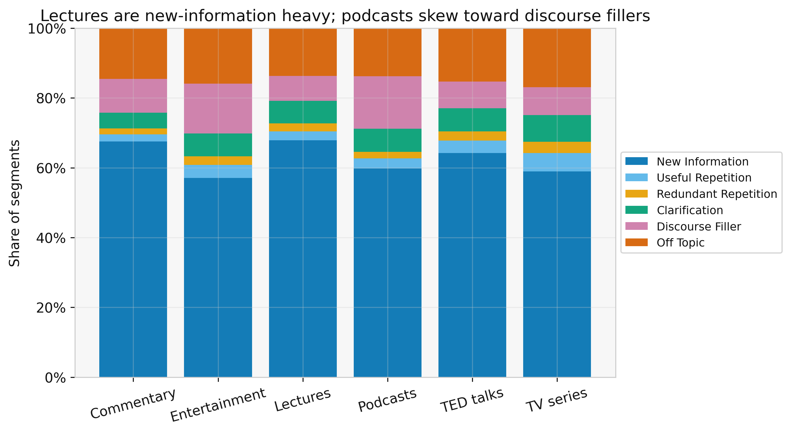
*Function-label distribution by genre: lectures are new-information heavy; podcasts skew toward discourse fillers.*
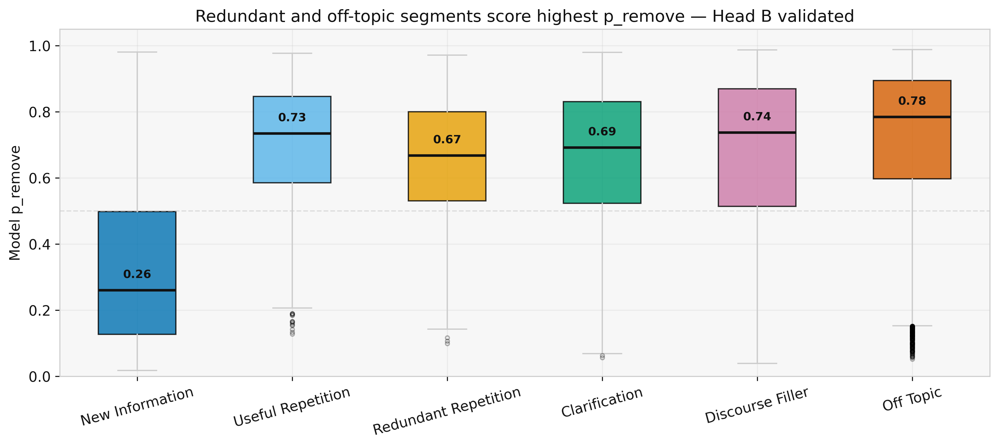
*Redundant and off-topic segments score highest p_remove, validating that Head B shapes the removal decision.*

**Head B classification:** accuracy=0.5165  macro-F1=0.3812

| Function class | F1 |
|---|---|
| New Information | 0.6943 |
| Useful Repetition | 0.2735 |
| Redundant Repetition | 0.2175 |
| Clarification | 0.2945 |
| Discourse Filler | 0.4278 |
| Off Topic | 0.3797 |
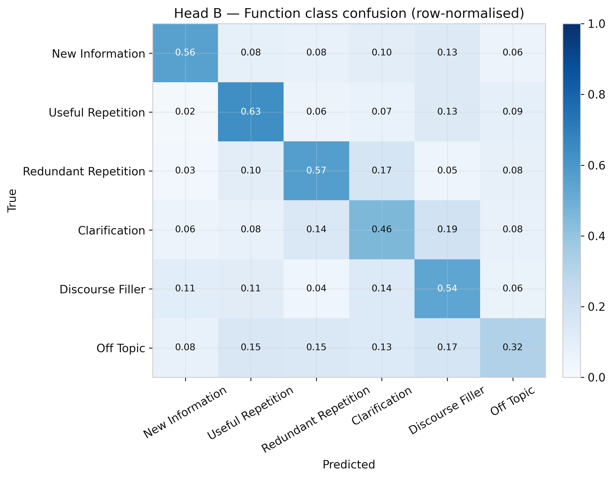
*Row-normalised confusion matrix for Head B. Off-diagonal mass shows which function classes are confused.*

### Head C — Disfluency classifier
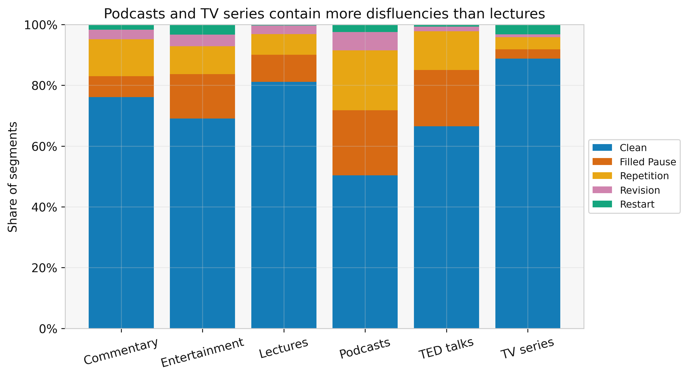
*Disfluency distribution by genre: podcasts and TV series contain more filled pauses and repetitions than lectures.*
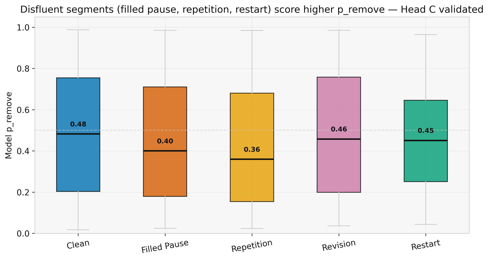
*Disfluent segments (filled pause, repetition, restart) score higher p_remove, validating Head C's signal.*

**Head C classification:** accuracy=0.9699  macro-F1=0.9629

| Disfluency class | F1 |
|---|---|
| Clean | 0.9808 |
| Filled Pause | 0.9854 |
| Repetition | 0.8984 |
| Revision | 0.9752 |
| Restart | 0.9747 |
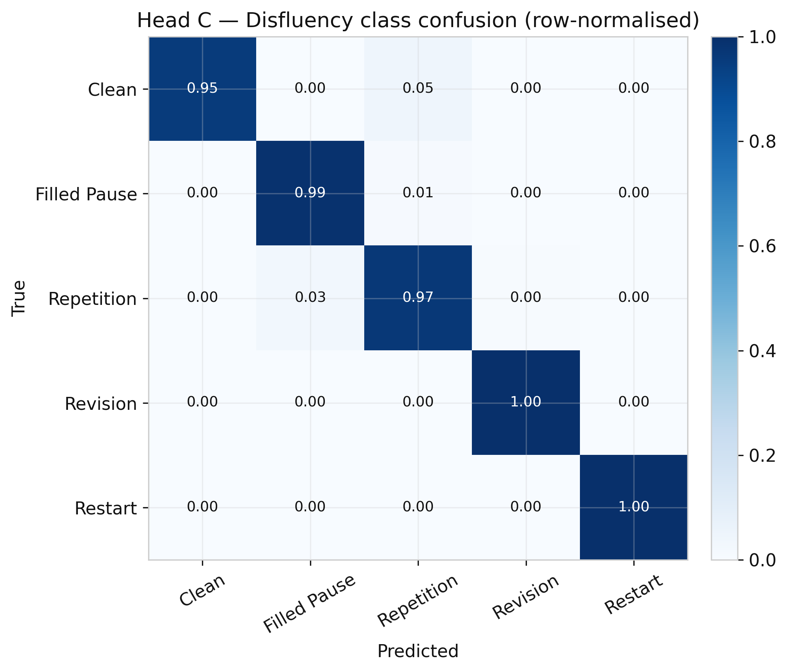
*Row-normalised confusion matrix for Head C. Confusion between adjacent disfluency classes is expected.*

### AUC by genre (95% bootstrap CI)
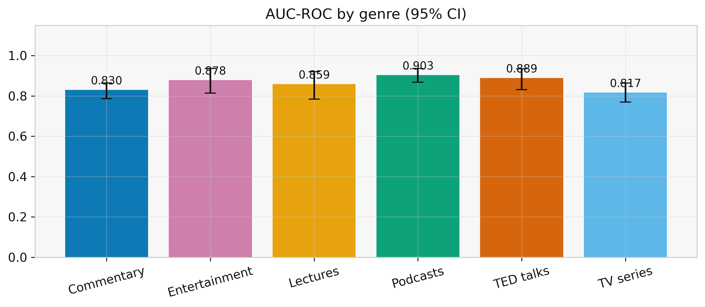
*AUC-ROC varies across genres — lectures show the highest discriminability, suggesting cleaner segment boundaries.*

### p_remove distribution
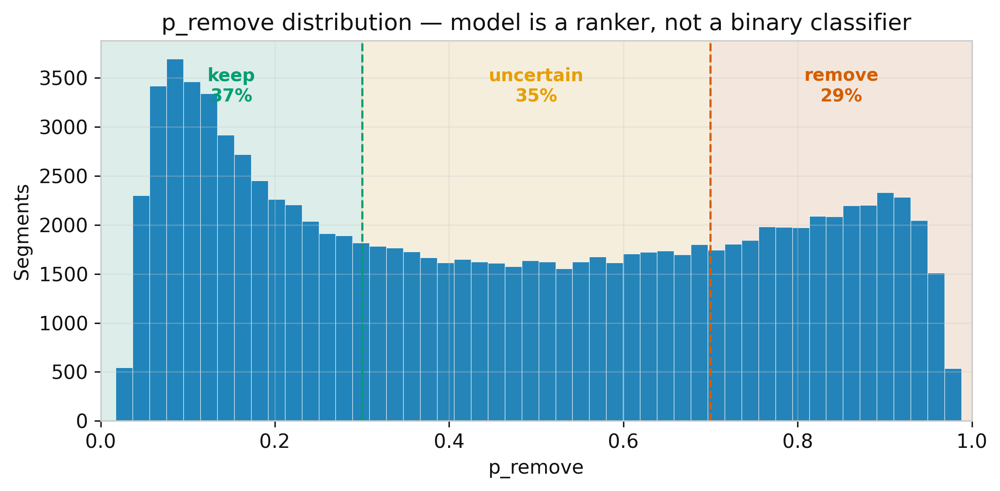
*p_remove distribution across all segments — meaningful mass in the uncertain zone confirms the model is a continuous ranker, not a binary classifier.*
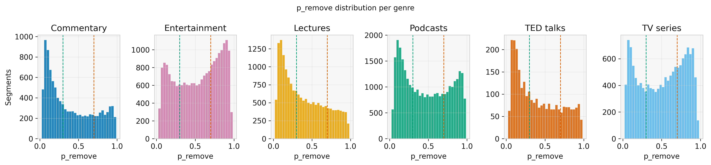
*Per-genre p_remove distributions — podcasts show more uncertain mass than lectures, consistent with higher genre-level ECE.*

## 3. Transcript-level (compression vs SBERT preservation)
| Method    |   Threshold |   Compression |   SBERT cosine |
|:----------|------------:|--------------:|---------------:|
| heuristic |        0.5  |        0.5351 |         0.8946 |
| heuristic |        0.6  |        0.6575 |         0.9547 |
| heuristic |        0.7  |        0.7795 |         0.9758 |
| heuristic |        0.8  |        0.9122 |         0.9879 |
| heuristic |        0.9  |        0.9807 |         0.9968 |
| heuristic |        0.95 |        0.9925 |         0.9982 |
| model     |        0.5  |        0.8031 |         0.9684 |
| model     |        0.6  |        0.8538 |         0.9762 |
| model     |        0.7  |        0.8978 |         0.9841 |
| model     |        0.8  |        0.943  |         0.9915 |
| model     |        0.9  |        0.9801 |         0.9968 |
| model     |        0.95 |        0.9946 |         0.9992 |
| sbert     |        0.5  |        0.7084 |         0.9679 |
| sbert     |        0.6  |        0.8655 |         0.9896 |
| sbert     |        0.7  |        0.9511 |         0.9968 |
| sbert     |        0.8  |        0.9889 |         0.9994 |
| sbert     |        0.9  |        0.9994 |         1      |
| sbert     |        0.95 |        1      |         1      |
| tfidf     |        0.5  |        0.6391 |         0.9369 |
| tfidf     |        0.6  |        0.7703 |         0.96   |
| tfidf     |        0.7  |        0.8803 |         0.9786 |
| tfidf     |        0.8  |        0.9379 |         0.9894 |
| tfidf     |        0.9  |        0.9686 |         0.9931 |
| tfidf     |        0.95 |        0.9778 |         0.995  |

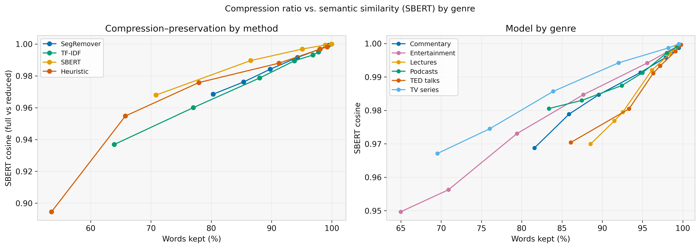
*Semantic similarity (SBERT centroid cosine) degrades smoothly with compression; genre curves diverge past 50% word retention.*
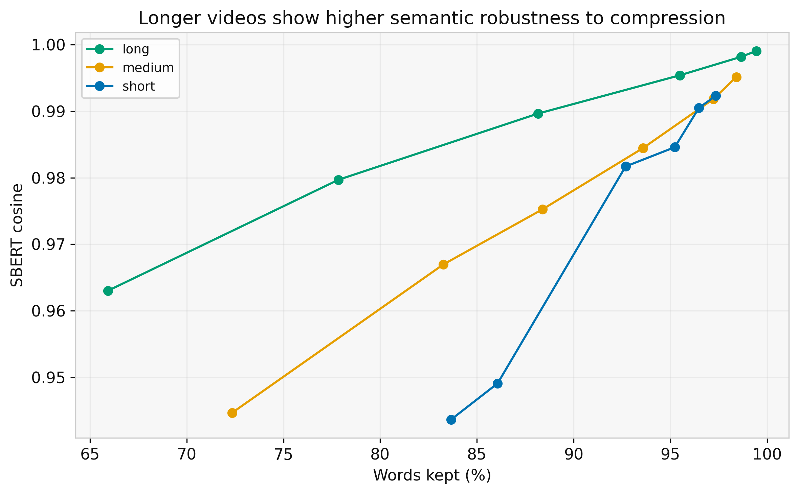
*Longer videos are more semantically robust to compression.*
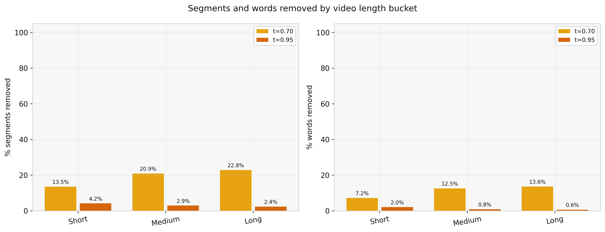
*Direct removability by length: percent segments and words removed at operating thresholds.*
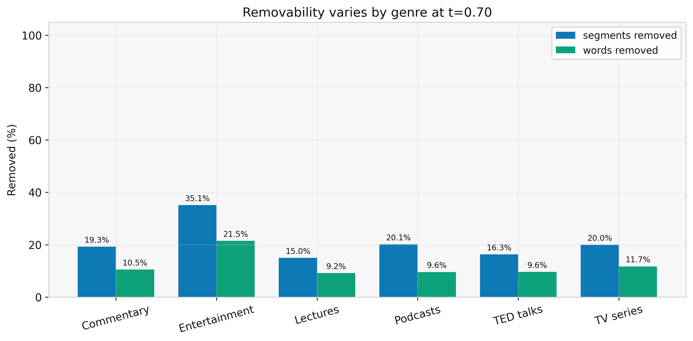
*Direct removability by genre at the primary threshold.*
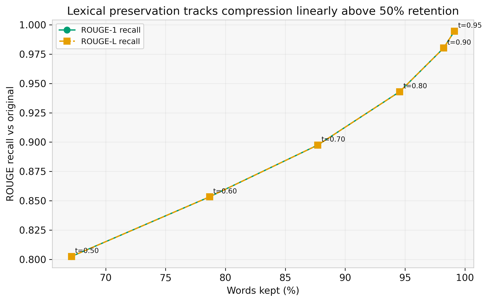
*ROUGE recall tracks compression linearly; the gap between ROUGE-1 and ROUGE-L indicates sentence fragmentation.*

## 4. Baseline comparison
| Method       |  ROC-AUC | ROC 95% CI |   PR-AUC | PR 95% CI | p vs model |
|--------------|----------|--------------|----------|--------------|------------|
| SegRemover   |   0.8811 | 0.8791-0.8831 |   0.8384 | 0.8355-0.8416 | — |
| Random       |   0.5044 | 0.5006-0.5073 |   0.4280 | 0.4244-0.4317 | 0.0000 |
| Heuristic    |   0.6426 | 0.6394-0.6457 |   0.6210 | 0.6172-0.6252 | 0.0000 |
| TF-IDF       |   0.7968 | 0.7944-0.7992 |   0.7222 | 0.7183-0.7268 | 0.0000 |
| SBERT        |   0.7400 | 0.7372-0.7428 |   0.6920 | 0.6887-0.6963 | 0.0000 |

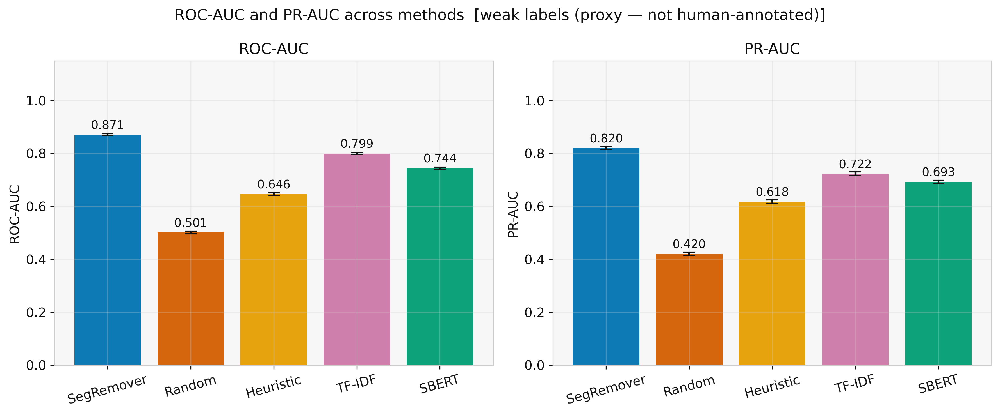
*SegRemover outperforms the unsupervised baselines; error bars show 95% bootstrap CI across 300 resamples.*
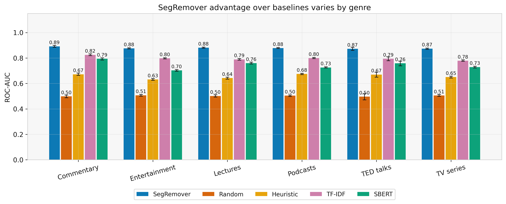
*Genre-level breakdown: model advantage over baselines varies by domain.*
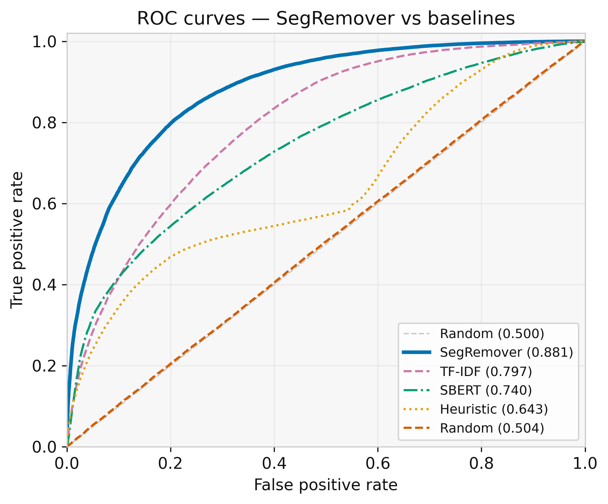
*ROC overlay: SegRemover's curve lies above all baselines at every FPR.*
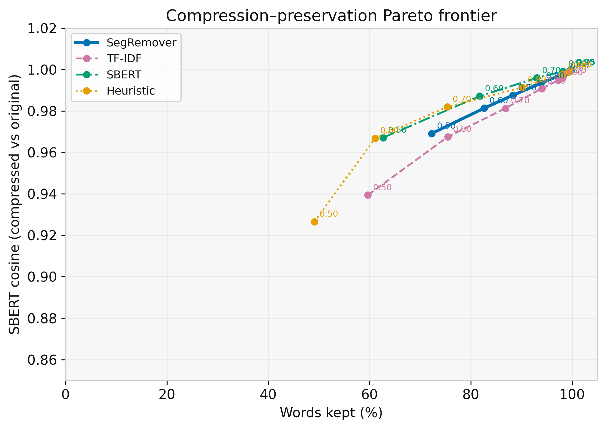
*Compression–preservation Pareto frontier: at every threshold SegRemover preserves more semantic content than unsupervised baselines.*

## 11. Cascade ablation
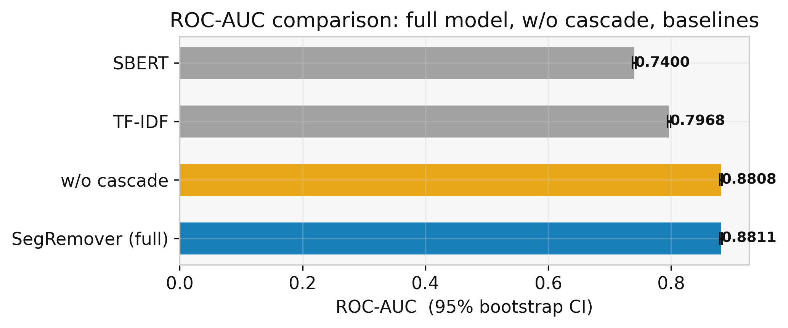
*Zeroing Head B/C logits from Head A's input reduces AUC, confirming the cascade design contributes beyond the encoder alone.*

| variant           |    auc |   ci_lo |   ci_hi |    n |
|:------------------|-------:|--------:|--------:|-----:|
| SegRemover (full) | 0.8638 |  0.8449 |  0.882  | 1487 |
| w/o cascade       | 0.8632 |  0.8441 |  0.8814 | 1487 |

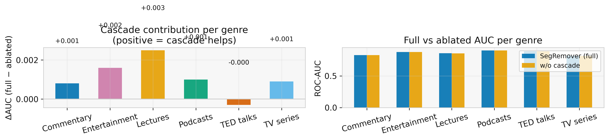
*Per-genre cascade contribution: ΔAUC (full − ablated) is largest in conversational genres where function-type is hardest to infer from semantics alone.*

## 12. Combined hero figure (paper Figure 2)
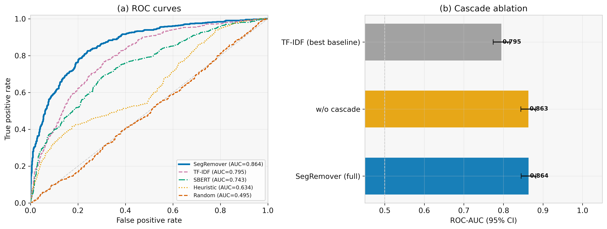
*Left: ROC overlay (SegRemover vs baselines). Right: cascade ablation — removing Head B/C logits costs ΔAUC.*

## 5. 4-way agreement
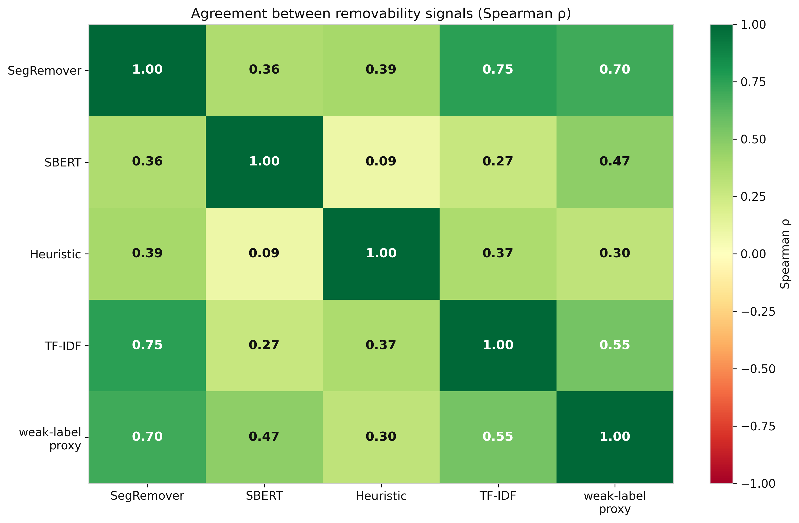
*Spearman ρ heatmap: model agrees most with SBERT centroid, confirming that semantic centrality guides removability.*
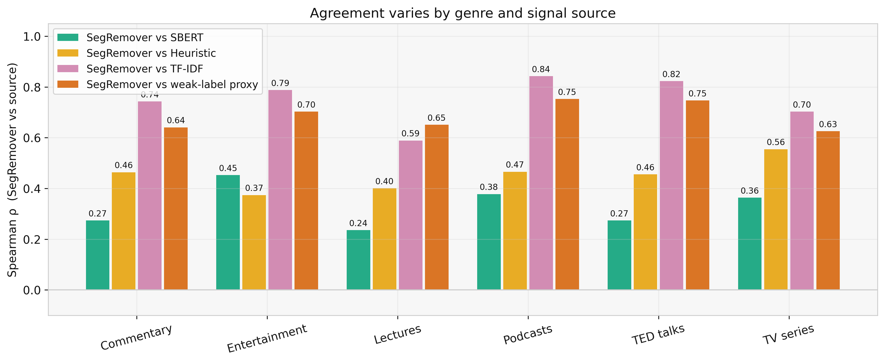
*Per-genre model–source Spearman ρ: agreement with SBERT drops in conversational genres (podcasts, entertainment).*

## 6. Gold evaluation (human annotations)
- **Spearman ρ vs gold soft target:** 0.5202 (p=0.0)
- **NDCG@20:** 0.8439
- **Weak-label accuracy vs gold:** 0.7995 F1=0.6719
- **Head B vs human gold_function:** accuracy=0.477  macro-F1=0.2406  _(model's function-type predictions compared to annotator labels)_

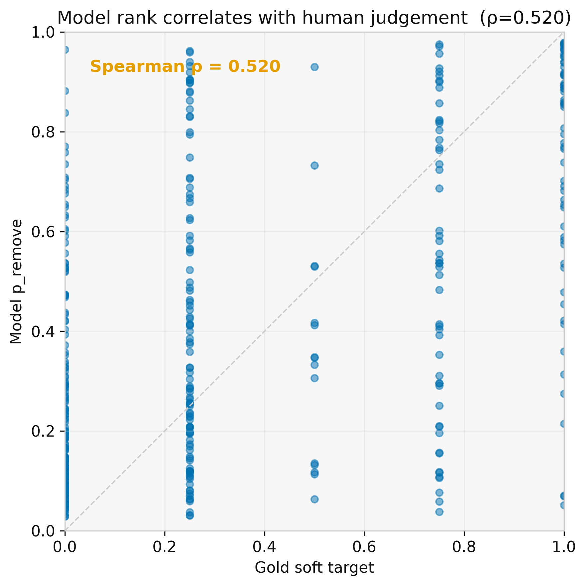
*Scatter of model p_remove vs gold soft target; upward trend confirms the model captures human removability judgements.*
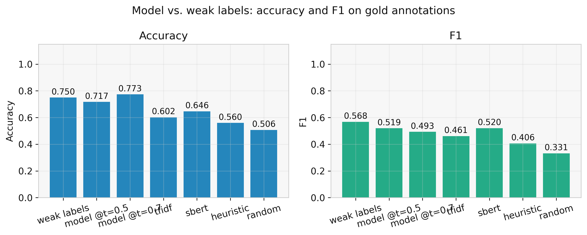
*Model outperforms weak labels against human binary annotations, validating the training signal.*

See `gold_eval.md` for full labeling-function accuracy breakdown.
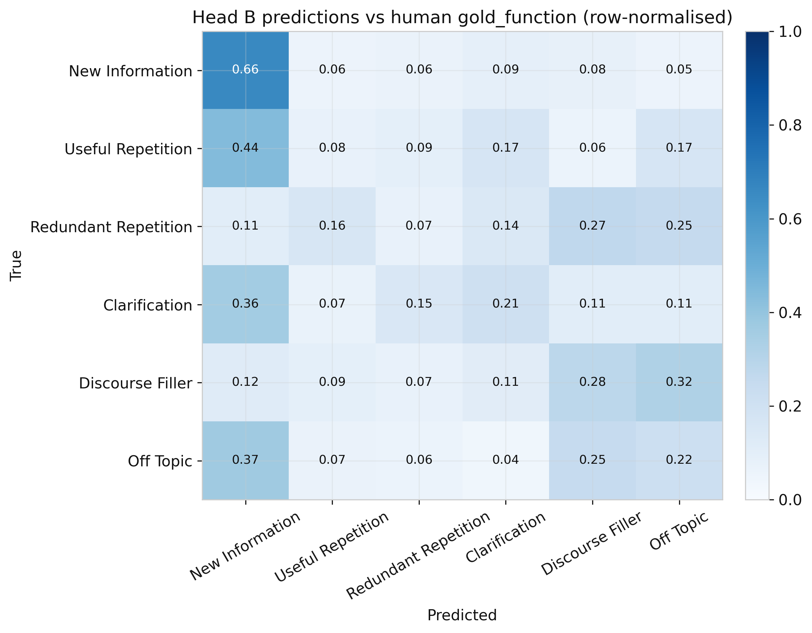
*Head B predicted function class vs human gold_function annotation — alignment here validates the explainability claim independently of weak-label training signal.*

## 8. Qualitative examples
See `qualitative_examples.md` — includes high-confidence keep/remove examples and any gold-based FP/FN examples.
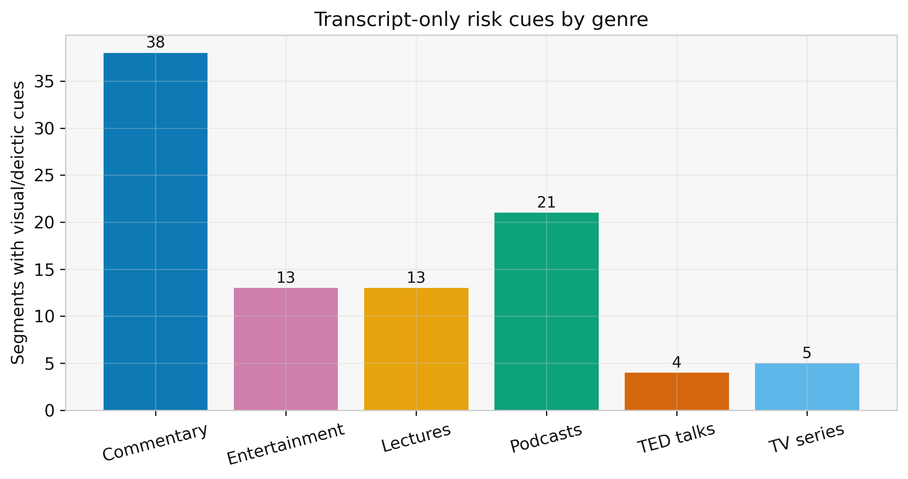
*Transcript-only limitation scan: visual/deictic cues by genre.*
See `transcript_only_risk_examples.md` for snippets.

## 9. Limitations
- Segment metrics evaluated against **weak labels** (proxy) unless gold annotations exist.
- Transcript SBERT cosine uses centroid-level similarity; does not capture fact-level preservation.
- ROUGE recall measures lexical preservation (`pip install rouge-score`); QA-preservation is not computed.
- Transcript-only risk examples are lexical cues, not confirmed errors, unless gold labels are present.
- Model scores can be missing for segments beyond the checkpoint `max_segs` truncation limit.
- Caption-type analysis requires `caption_type` field in segment data.
- The 6-class function taxonomy (new_information, useful_repetition, redundant_repetition, clarification, discourse_filler, off_topic) and the 5-class disfluency taxonomy are hand-crafted without empirical validation that these specific categories are optimal for the removability task. No prior work establishes this taxonomy as the correct decomposition of segment function for spoken YouTube content; alternative label designs (finer-grained, coarser, or grounded in a different linguistic theory) might yield stronger cascade signal or better Head B/C accuracy. The taxonomies should be treated as design choices, not established ground truth.

## Appendix: Reproducibility
```
eval seed       : 42
eval sample     : 1000
encoder         : roberta-base
inter_layers    : 4
temperature T   : 1.1
max_segs        : 256
max_tok         : 384
checkpoint      : models/best.pt
data_dir        : data/processed
thresholds      : [0.5, 0.6, 0.7, 0.8, 0.9, 0.95]
```

## Run command
```bash
python src/eval.py --checkpoint models/best.pt --data-dir data/processed
```